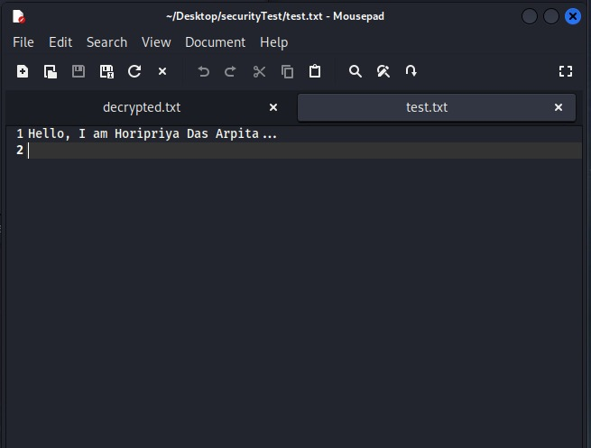
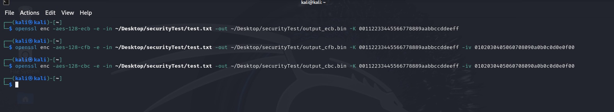
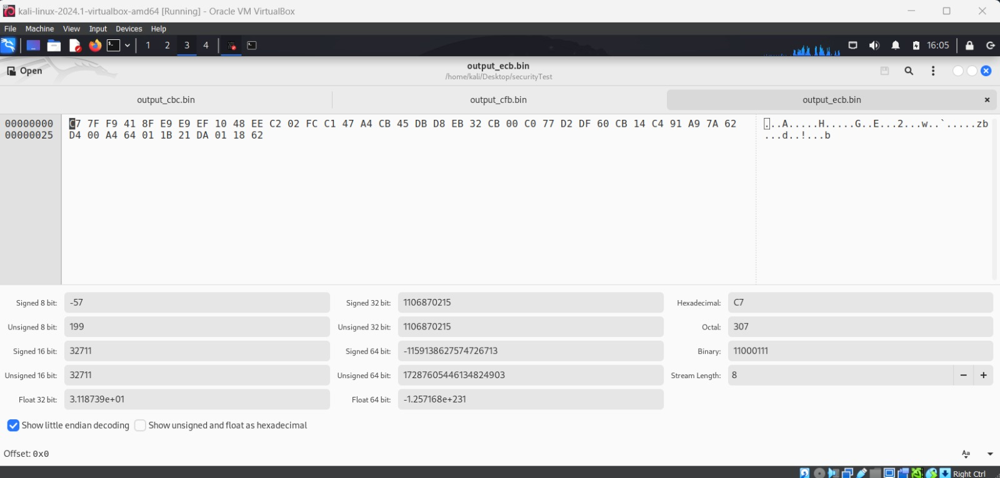
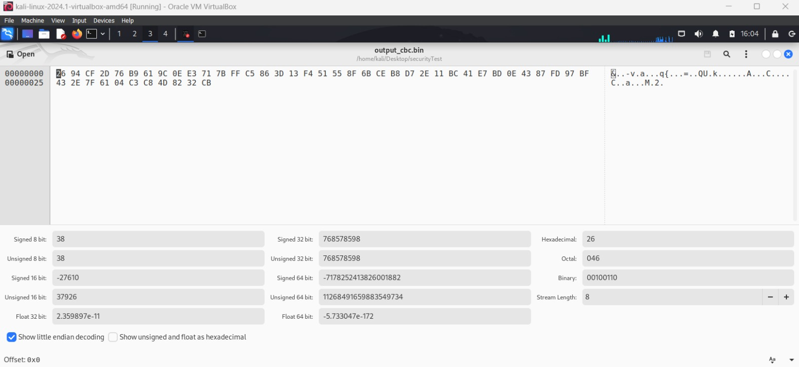
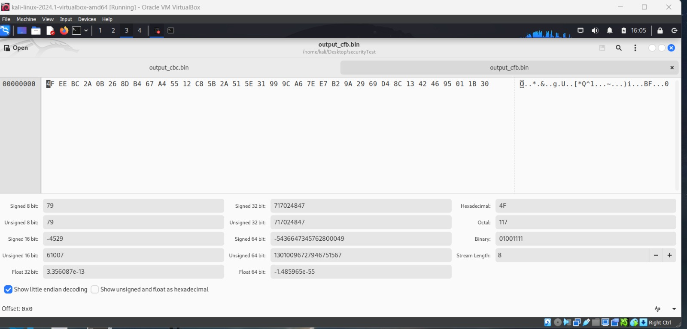

# Task - 1 

* New Text file named `test.txt`   


### Commands :

Encrypt Using AES-128 in ECB mode : 

```
openssl enc -aes-128-ecb -e -in ~/Desktop/securityTest/test.txt -out ~/Desktop/securityTest/output_ecb.bin -K 00112233445566778889aabbccddeeff
```
Encrypt Using AES-128 in CBC mode :
```
openssl enc -aes-128-cbc -e -in ~/Desktop/securityTest/test.txt -out ~/Desktop/securityTest/output_cbc.bin -K 00112233445566778889aabbccddeeff -iv 0102030405060708090a0b0c0d0e0f00
```

Encrypt Using AES-128 in CFB mode :
```
openssl enc -aes-128-cfb -e -in ~/Desktop/securityTest/test.txt -out ~/Desktop/securityTest/output_cfb.bin -K 00112233445566778889aabbccddeeff -iv 0102030405060708090a0b0c0d0e0f00
```

 

### Output Files : 

#### ECB mode : 


#### CBC mode : 


#### CFB mode : 



