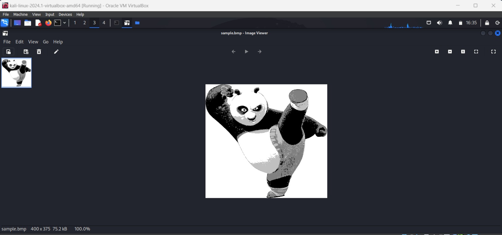

# Task - 2:
#### Using this sample image. `sample.bmp`  


### Commands :

Generating -K and -iv:
```
openssl rand -hex 16 > key.txt 
```

```
openssl rand -hex 16 > iv.txt
```
Encryption code for ECB mode :
```
openssl enc -aes-128-ecb -e -in ~/Desktop/securityTest/sample.bmp -out ~/Desktop/securityTest/encryptedimg_ecb.bmp -K $(cat key.txt)
```

Encryption code for CBC mode :
```
openssl enc -aes-128-cbc -e -in ~/Desktop/securityTest/sample.bmp -out ~/Desktop/securityTest/encryptedimg_cbc.bmp -K $(cat key.txt) -iv $(cat iv.txt)

```

Substituting the header of the encrypted files with that of the authentic image, I obtained the following images.

#### ECB mode :  
ghex
img
#### CBC moce : 
ghex
img


#### Observations:

* In ECB mode, it is possible to recover some information from the encrypted image.   

 * In CBC mode, it is impossible to recover any information from the encrypted image.
