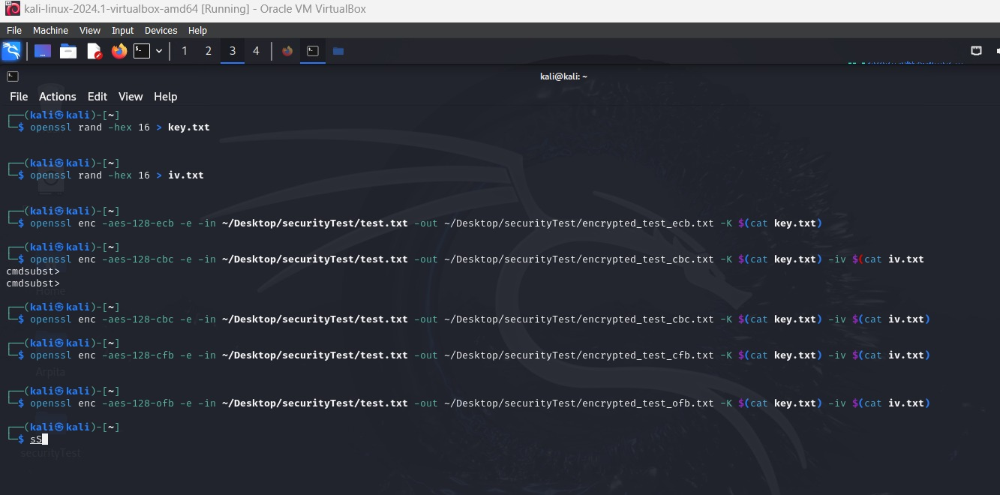

# Task 4

Here I tested the previous text files and related all things are attached in the repository of Task4.

### Commands 

Generating -K and -iv: 
```
openssl rand -hex 16 > key.txt 
```

```
openssl rand -hex 16 > iv.txt
```
#### ECB Mode: 
```
openssl enc -aes-128-ecb -e -in ~/Desktop/securityTest/test.txt -out ~/Desktop/securityTest/encrypted_test_ecb.txt -K $(cat key.txt)
```

#### CBC Mode:
```
openssl enc -aes-128-cbc -e -in ~/Desktop/securityTest/test.txt -out ~/Desktop/securityTest/encrypted_test_cbc.txt -K $(cat key.txt) -iv $(cat iv.txt)
```

#### CFB Mode:
```
openssl enc -aes-128-cfb -e -in ~/Desktop/securityTest/test.txt -out ~/Desktop/securityTest/encrypted_test_cfb.txt -K $(cat key.txt) -iv $(cat iv.txt) 
```

#### OFB Mode:
```
openssl enc -aes-128-ofb -e -in ~/Desktop/securityTest/test.txt -out ~/Desktop/securityTest/encrypted_test_ofb.txt -K $(cat key.txt) -iv $(cat iv.txt) 
```



#### Observations and Explanations:

* In ECB mode, padding becomes necessary because it treats each block of data separately during encryption. If the size of the plaintext isn't a perfect multiple of the block size, padding is essential to complete the last block.

* Similarly, CBC mode mandates padding for the same rationale as ECB. Besides, CBC mode involves an IV (Initialization Vector) for the XOR operation with the initial block, though padding remains necessary for the final block.

* Contrarily, CFB mode eliminates the need for padding since it operates at the byte level rather than on entire blocks. Consequently, the length of the ciphertext remains identical to that of the plaintext.

* Likewise, OFB mode dispenses with the requirement for padding as it generates a key stream independently of the plaintext. Consequently, the length of the ciphertext mirrors that of the plaintext.