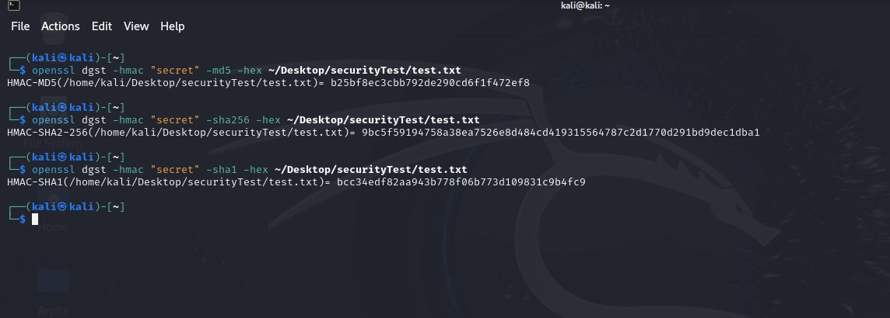

# Task 5

Here is the text file:

```
After a long struggle and a relentless movement, the Shahjalal University of Science and Technology (SUST) was established in 1986.

```

### Commands :

```
# MD5
openssl dgst -md5 ~/Desktop/securityTest/test.txt

# SHA-256
openssl dgst -sha256 ~/Desktop/securityTest/test.txt

# SHA-512
openssl dgst -sha512 ~/Desktop/securityTest/test.txt
```

### Output :

 


#### Observations and Explanations:

* Hash Length:  
  - MD5 produces a 128-bit (16-byte) hash value.  
  - SHA-256 produces a 256-bit (32-byte) hash value.  
  - SHA-512 produces a 512-bit (64-byte) hash value.

* Security Levels:  
  - MD5 is considered weak and vulnerable to collision attacks.
  - SHA-256 and SHA-512 offer stronger security properties and are recommended for security-critical applications.

* Speed:
  - MD5 is faster than SHA-256 and SHA-512.
  - SHA-512 is slower than SHA-256.