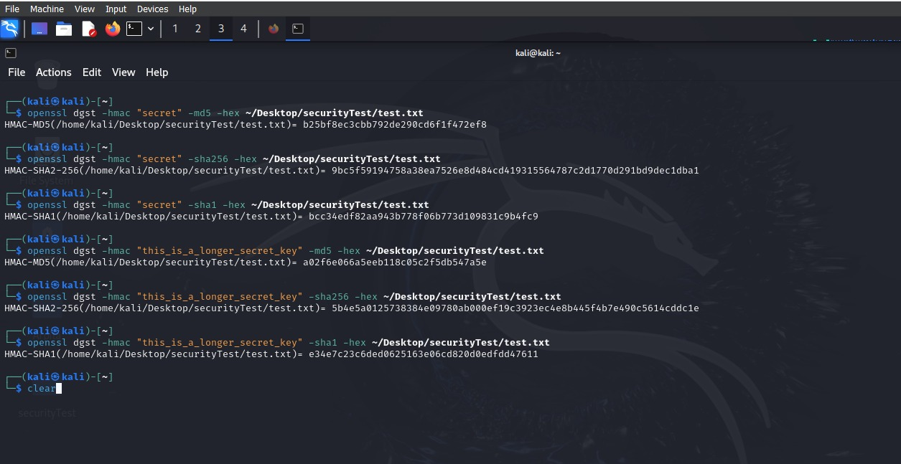

# Task 6 

#### Commands :
Short Key length:

```
# HMAC-MD5
openssl dgst -hmac abcdef1234567890 -md5 -hex ~/Desktop/securityTest/test.txt

# HMAC-SHA256
openssl dgst -hmac abcdef1234567890 -sha256 -hex ~/Desktop/securityTest/test.txt

# HMAC-SHA1
openssl dgst -hmac abcdef1234567890 -sha1 -hex ~/Desktop/securityTest/test.txt

```

Long Key length: 
```
# HMAC-MD5
openssl dgst -hmac "this_is_a_longer_secret_key" -md5 -hex ~/Desktop/securityTest/test.txt

# HMAC-SHA256
openssl dgst -hmac "this_is_a_longer_secret_key" -sha256 -hex ~/Desktop/securityTest/test.txt

# HMAC-SHA1
openssl dgst -hmac "this_is_a_longer_secret_key" -sha1 -hex ~/Desktop/securityTest/test.txt 
```



### Observations: 

* HMAC-MD5:

  - Short key: Limited key length increases vulnerability to brute-force attacks.
  - Long key: Extended key length strengthens security, mitigating brute-force risks.

* HMAC-SHA256:

  - Short key: Reduced key size raises susceptibility to brute-force attacks.
  - Long key: Expanded key size significantly boosts security.

* HMAC-SHA1:

  - Short key: Smaller keys are more vulnerable to brute-force attacks despite SHA1's inherent strength.
  - Long key: Larger keys enhance security significantly, making brute-force attacks impractical.
  