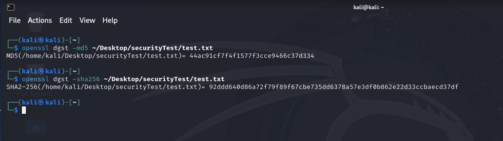

# Task 7 

### Commands: 

```
openssl dgst -md5 ~/Desktop/securityTest/test.txt
openssl dgst -sha256 ~/Desktop/securityTest/test.txt 
```

#### Output:


Observations:

* The hash values of H1 and H2 are different.

* After changing the text file, the hash values of H1 and H2 changed.

* H1 uses MD5, while H2 uses SHA-256.

* MD5 produces a 128-bit hash value, while SHA-256 produces a 256-bit hash value.

```cpp

```