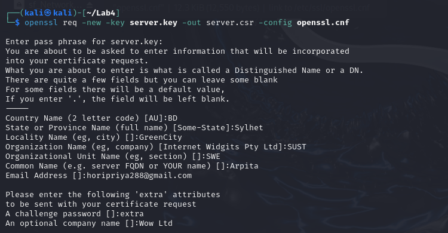
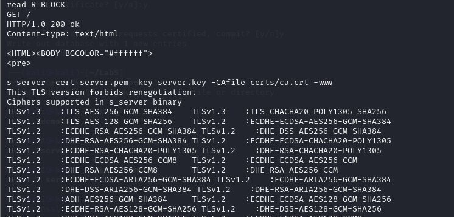

# Lab - 5

## Task 1 : Becoming a certificate authority  

To proceed with the setup, follow these steps:

Step 1: Configure the OpenSSL Environment
Copy the Configuration File:
You already copied openssl.cnf to your Lab4 directory.


Create Required Sub-directories:
Look at the [ CA_default ] section in openssl.cnf and create the directories specified: 

```sh
mkdir -p certs newcerts private
```


Create the index.txt and serial Files:
```sh
touch index.txt
echo 1000 > serial
```
 

Step 2: Create a Self-Signed Certificate for the CA  

Generate a Private Key for the CA:

```sh
openssl genpkey -algorithm RSA -out private/ca.key -aes256
```

Generate a Self-Signed Certificate for the CA:

```sh
openssl req -new -x509 -key private/ca.key -out certs/ca.crt -days 3650
```


ca.crt File: 


TASK 2 Creating a Certificate for example.com  

Step 1: Generate Public/Private Key Pair
Run the following command to generate an RSA key pair:

```sh
openssl genrsa -des3 -out server.key 1024
```


You will be prompted to provide a password to protect the key.

Step 2: Generate a Certificate Signing Request (CSR)
Use the generated key to create a CSR:

```sh
openssl req -new -key server.key -out server.csr -config openssl.cnf
```


Ensure you use example.com as the common name.

Step 3: Generate the Certificate
Sign the CSR with the CA to generate a certificate:

```sh
openssl ca -in demoCA/server.csr -out demoCA/server.crt -cert demoCA/certs/ca.crt -keyfile demoCA/private/ca.key -config openssl.cnf
```


Step 3: Launching a Simple Web Server

Step 1: Combine the Secret Key and Certificate
Combine the key and certificate into one file:

```sh
cp server.key server.pem
cat server.crt >> server.pem
```

Step 2: Launch the Web Server
Use the combined file to launch the web server:   

1.Start the OpenSSL Server with the CA Certificate:  
Make sure to include the CA certificate when starting the OpenSSL server.

```sh
openssl s_server -cert server.pem -key server.key -CAfile certs/ca.crt -www

```
 


2.Connect Using OpenSSL Client with CA Certificate:
Provide the CA certificate to the OpenSSL client so it can verify the server certificate.

```sh
openssl s_client -connect localhost:4433 -CAfile certs/ca.crt
```
 

SSL session :


### Testing the Connection:
Since the connection is successful, you can now test the interaction with the server. In your openssl s_client session, you can type GET / and press Enter to send an HTTP request to the server. You should see an HTTP response from the server.



The server will listen on port 4433 by default. You can access it at https://example.com:4433/.

Adding the CA Certificate to Firefox
Go to Preferences -> Advanced -> View Certificates.
Import ca.crt.
Select "Trust this CA to identify web sites".
Now, navigate to https://example.com:4433 in your browser.


